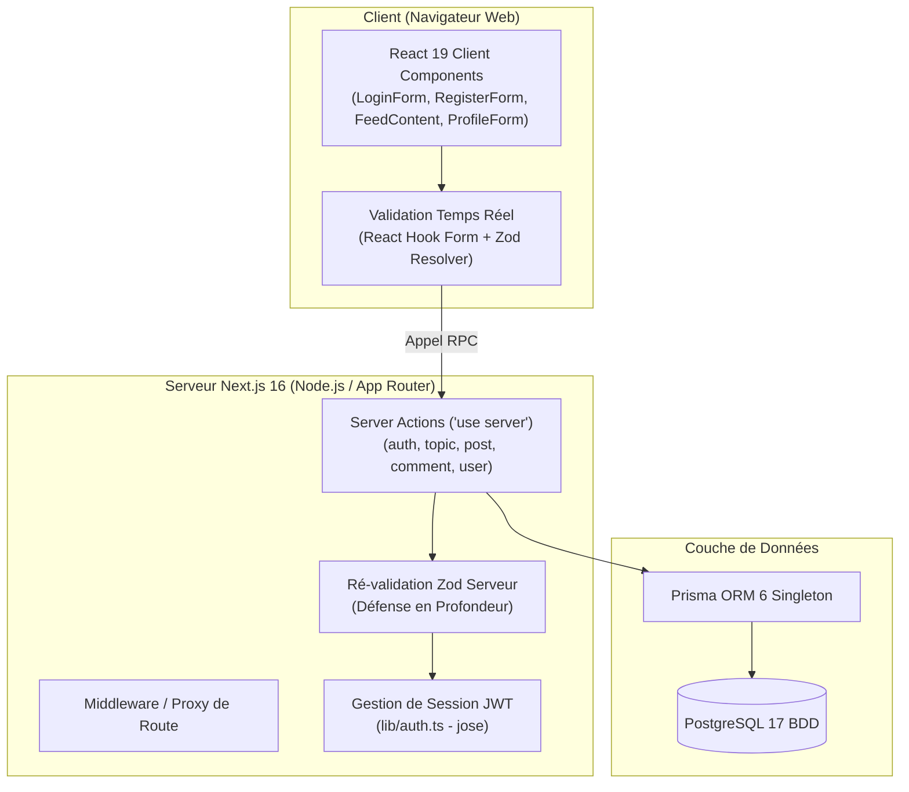
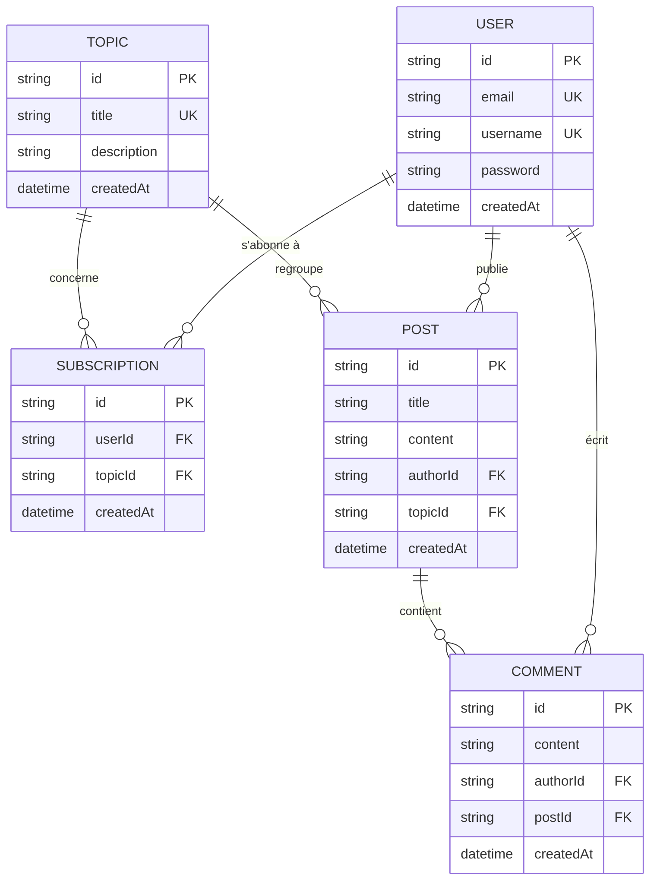

Auteur : Yao Kissi

Version : 1.0.0

Date : 28/08/2026

**Version 1.0.0 (Release Finale)**

# **Documentation et rapport du projet MDD**

## **Sommaire**

1. Présentation générale du projet
   1.1 Objectifs du projet
   1.2 Périmètre fonctionnel
2. Architecture et conception technique
   2.1 Schéma global de l'architecture
   2.2 Choix techniques
   2.3 API (Server Actions) et schémas de données
3. Tests, performance et qualité
   3.1 Stratégie de test
   3.2 Rapport de performance et optimisation
   3.3 Revue technique
4. Documentation utilisateur et supervision
   4.1 FAQ utilisateur
   4.2 Supervision et tâches déléguées à l'IA
5. **Annexes**

---

## **1. Présentation générale du projet**

### **1.1 Objectifs du projet**

Le projet **MDD (Monde de Dév)** est une plateforme de réseau social full-stack développée pour l'entreprise **ORION**. 

L'objectif principal est de fournir un espace communautaire moderne et sécurisé permettant aux développeurs de :
- S'abonner à des thèmes de programmation spécifiques (JavaScript, TypeScript, React, Python, DevOps, etc.).
- Consulter un fil d'actualités personnalisé contenant uniquement les articles des thèmes auxquels ils sont abonnés.
- Publier de nouveaux articles en rattachant chaque publication à un thème.
- Interagir avec la communauté en publiant et consultant des commentaires sur chaque article.
- Gérer leur profil utilisateur (nom d'utilisateur, e-mail, mot de passe) et leurs abonnements.

### **1.2 Périmètre fonctionnel**

Toutes les fonctionnalités spécifiées au cahier des charges et aux maquettes Figma ont été intégralement développées, testées et validées.

| Fonctionnalités | Description | Statut |
| :---- | :---- | :---- |
| **Authentification & Session** | Inscription, connexion, hachage `bcryptjs` et gestion de session via cookies HTTP-Only JWT avec `jose`. | **Terminé** |
| **Catalogue des Thèmes** | Affichage en grille sur 2 colonnes des thèmes avec bouton d'abonnement/désabonnement dynamique (`useTransition`). | **Terminé** |
| **Fil d'Actualités Personnalisé** | Filtrage strict des articles par thèmes abonnés (`WHERE topicId IN (...)`) avec tri chronologique asc/desc. | **Terminé** |
| **Création & Publication d'Articles** | Formulaire de création conforme au design Figma avec sélection de thème, titre, contenu et flèche retour. | **Terminé** |
| **Détail d'Article & Commentaires** | Page dynamique `/posts/[id]` avec affichage de l'article, bulles de commentaires `#F3F3F3` et icône d'envoi violette. | **Terminé** |
| **Gestion du Profil Utilisateur** | Modification du pseudo/email, mise à jour optionnelle du mot de passe et gestion en direct des abonnements. | **Terminé** |

---

## **2. Architecture et conception technique**

### **2.1 Schéma global de l'architecture**

L'application repose sur le modèle unifié de **Next.js 16 (App Router)** et des **Server Actions**, éliminant le besoin d'une API REST externe séparée.

#### Choix d'organisation technique du projet :
- **`actions/`** : Centralise toutes les Server Actions typées (Auth, Topic, Post, Comment, User).
- **`app/`** : Routage unifié Next.js (dossiers `(auth)`, `(dashboard)`, `posts/[id]`).
- **`components/`** : Composants modulaires découpés entre `features/`, `forms/` et `layout/`.
- **`lib/`** : Schémas Zod partagés (`validators/`), utilitaires de session JWT (`auth.ts`) et singleton Prisma (`prisma.ts`).

### **2.2 Choix techniques**

| Éléments choisis | Type | Lien documentation | Objectif du choix | Justification |
| :---- | :---- | :---- | :---- | :---- |
| **Next.js 16** | Framework Full-Stack | [docs](https://nextjs.org) | Architecture unifiée et Server Components | Performance de rendu, SEO, invalidation du cache via `revalidatePath`. |
| **TypeScript 5** | Langage | [docs](https://www.typescriptlang.org) | Typage strict de bout en bout | Détection des erreurs à la compilation, autocomplétion et maintenabilité. |
| **Tailwind CSS 4** | Framework CSS | [docs](https://tailwindcss.com) | Stylisation réactive | Intégration fidèle du design system Figma et de la palette de couleurs. |
| **Prisma 6** | ORM | [docs](https://www.prisma.io) | Requêtage BDD typé | Modélisation des relations BDD et migrations sécurisées. |
| **PostgreSQL 17** | Base de données | [docs](https://www.postgresql.org) | BDD relationnelle robuste | Stockage fiable des utilisateurs, articles, thèmes, commentaires et abonnements. |
| **`jose`** | Sécurité Session JWT | [docs](https://github.com/panva/jose) | Signature & déchiffrement JWT | Compatible 100% Edge/Next.js, stockage dans un cookie `HttpOnly`. |
| **`bcryptjs`** | Chiffrement | [docs](https://github.com/dcodeIO/bcrypt.js) | Hachage de mot de passe | Sécurisation des mots de passe en BDD avec facteur de salage 10. |
| **Zod 3** | Validation de données | [docs](https://zod.dev) | Schémas de validation | Validation à double niveau (client + serveur) pour la sécurité OWASP. |
| **Vitest 4** | Framework de test | [docs](https://vitest.dev) | Tests unitaires & serveur | Execution ultra-rapide des tests Zod et JWT en mémoire (7ms). |
| **Playwright 1.62** | Framework E2E | [docs](https://playwright.dev) | Tests End-to-End | Validation des parcours utilisateurs complets dans un vrai navigateur Chrome. |

### **2.3 API (Server Actions) et schémas de données**

#### Tableau des Server Actions

| Server Action | Type | Description | Retour / Réponse |
| :---- | :---- | :---- | :---- |
| `registerUserAction` | Mutation | Inscription d'un utilisateur, hachage bcrypt et création du cookie JWT | `ActionState` (success, message, errors) |
| `loginUserAction` | Mutation | Connexion par email/pseudo, vérification bcrypt et cookie `HttpOnly` | `ActionState` (success, message) |
| `logoutUserAction` | Mutation | Suppression du cookie de session `mdd_session` | `{ success: true }` |
| `getTopicsAction` | Query | Récupère la liste des thèmes avec la propriété `isSubscribed` | `TopicWithSubscription[]` |
| `toggleSubscriptionAction` | Mutation | Bascule l'état d'abonnement à un thème (insert/delete Prisma) | `TopicActionState` (success, isSubscribed) |
| `getFeedPostsAction` | Query | Récupère les articles des thèmes abonnés triés par date asc/desc | `PostWithDetails[]` |
| `createPostAction` | Mutation | Création d'un article et déclenchement de `revalidatePath('/feed')` | `CreatePostActionState` (success, postId) |
| `getPostDetailsAction` | Query | Charge le détail d'un article avec auteur, thème et commentaires | `PostDetails | null` |
| `createCommentAction` | Mutation | Ajoute un commentaire sur un article et rafraîchit la page | `CommentActionState` (success, comment) |
| `updateProfileAction` | Mutation | Met à jour le pseudo/email/password et régénère le cookie JWT | `ActionState` (success, message) |

#### Représentation visuelle des relations (Schéma Prisma ERD)

---

## **3. Tests, performance et qualité**

### **3.1 Stratégie de test**

Une suite de tests complète combinant **Vitest** (Unitaires) et **Playwright** (End-to-End) a été mise en place.

| Type de test | Outil / framework | Portée | Résultats |
| :---- | :---- | :---- | :---- |
| **Test unitaire (Zod)** | **Vitest 4** | Validation des formulaires (`validators.test.ts`) | ✅ 12/12 tests PASS (100% couverture Zod) |
| **Test unitaire (JWT)** | **Vitest 4** | Chiffrement/Déchiffrement `jose` (`auth-crypto.test.ts`) | ✅ 2/2 tests PASS |
| **Test unitaire (Actions/Utils)** | **Vitest 4** | Logique des Server Actions et utilitaires CSS | ✅ 5/5 tests PASS |
| **Test End-to-End (E2E)** | **Playwright 1.62** | Parcours critiques (Auth, Topics, Posts, Profile) | ✅ 4/4 parcours PASS (Chromium) |

### **3.2 Rapport de performance et optimisation**

Des choix d'optimisation majeurs ont été appliqués :
- **Server Components Next.js 16** : Rendu des pages côté serveur pour un chargement HTML immédiat et un poids JS minimal transmis au client.
- **Invalidation ciblée du cache** : Utilisation de `revalidatePath('/feed')` lors de la publication d'un article pour forcer la mise à jour des données sans recharger le navigateur.
- **Recherche d'abonnement optimisée** : Utilisation d'un tableau d'identifiants et de la méthode `.includes()` pour un filtrage réactif et lisible.

### **3.3 Revue technique**

- **Point fort (Sécurité OWASP)** : Double validation systématique Zod (client + serveur) et stockage de la session dans un cookie `HttpOnly` protégé contre les attaques XSS et CSRF.
- **Point fort (Typage strict)** : 100% TypeScript Strict sans aucun type `any` ou contournement.
- **Point fort (Design Figma)** : Fidélité stricte au design system Figma (palette de couleurs `#7763C5`, `#F3F3F3`, menu mobile responsive).
- **À améliorer (Pagination BDD)** : Chargement actuel de l'ensemble des articles sur `/feed`.
- **Action corrective recommandée** : Implémentation d'une pagination par lots avec Prisma `take` et `skip`.

---

## **4. Documentation utilisateur et supervision**

### **4.1 FAQ utilisateur**

**Q : Pourquoi mon fil d'actualités (`/feed`) est-il vide lors de ma première connexion ?**  
*R : Le fil d'actualités s'adapte à vos préférences ! Il affiche uniquement les articles appartenant aux thèmes auxquels vous êtes abonné. Rendez-vous sur la page **Thèmes** (`/topics`) et cliquez sur "S'abonner" à un ou plusieurs thèmes.*

**Q : Puis-je modifier mon nom d'utilisateur ou mon adresse email sans changer mon mot de passe ?**  
*R : Oui ! Sur la page **Profil** (`/profile`), modifiez votre nom d'utilisateur ou votre adresse e-mail et laissez le champ mot de passe vide, puis cliquez sur "Sauvegarder".*

**Q : Comment fonctionne le bouton de tri sur le fil d'actualités ?**  
*R : Le bouton "Trier par ↓" permet d'inverser instantanément l'ordre d'affichage des articles (du plus récent au plus ancien ou inversement).*

**Q : Que faire si le serveur affiche une erreur de connexion à la BDD ?**  
*R : Vérifiez que le conteneur Docker PostgreSQL est actif (`docker ps`) et exécutez `npx prisma db push` puis `npx prisma db seed`.*

### **4.2 Supervision et tâches déléguées à l'IA**

| Tâche déléguée | Outil / collaborateur | Objectif | Vérification effectuée |
| :---- | :---- | :---- | :---- |
| **Génération des schémas Zod** | Antigravity AI | Centraliser les schémas de validation client/serveur | Vérification des règles de regex mot de passe et tests unitaires Vitest |
| **Mise en place des Server Actions** | Antigravity AI | Implémenter les requêtes Prisma et la revalidation du cache | Vérification des types TypeScript et tests manuels BDD |
| **Configuration Playwright E2E** | Antigravity AI | Automatiser les tests de parcours utilisateur Chrome | Exécution des scénarios dans Chromium et génération du rapport HTML |
| **Rédaction de la documentation** | Antigravity AI | Rédiger le README, TESTS_REPORT et CODE_REVIEW | Relecture complète et validation de l'alignement avec les consignes P5 |

---

## **5. Annexes**

- **[`README.md`](file:///Users/yaokissi/Hard_Disc/Open-Classroom/projet5/README.md)** : Guide d'installation rapide, stack technique et documentation des Server Actions.
- **[`TESTS_REPORT.md`](file:///Users/yaokissi/Hard_Disc/Open-Classroom/projet5/TESTS_REPORT.md)** : Rapport de tests automatisés et synthèse de couverture.
- **[`CODE_REVIEW.md`](file:///Users/yaokissi/Hard_Disc/Open-Classroom/projet5/CODE_REVIEW.md)** : Rapport complet de revue de code et audit de sécurité.
- **[`prisma/schema.prisma`](file:///Users/yaokissi/Hard_Disc/Open-Classroom/projet5/prisma/schema.prisma)** : Modèles de données PostgreSQL Prisma.
- **Rapports visuels HTML** : `./coverage/index.html` (Vitest) et `./playwright-report/index.html` (Playwright).
